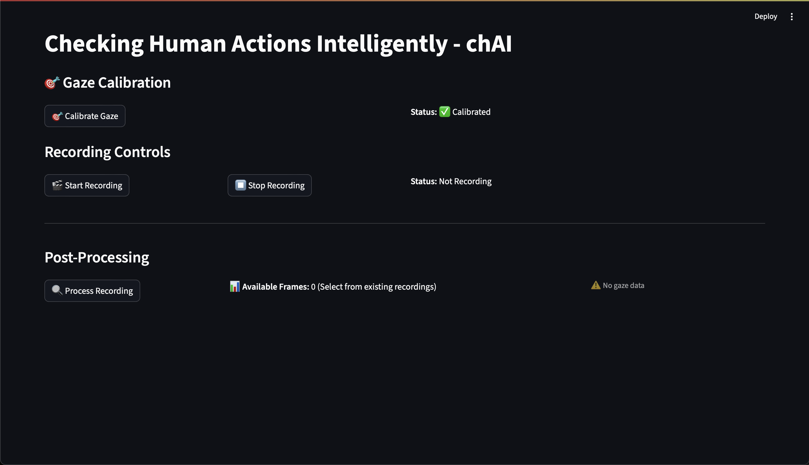
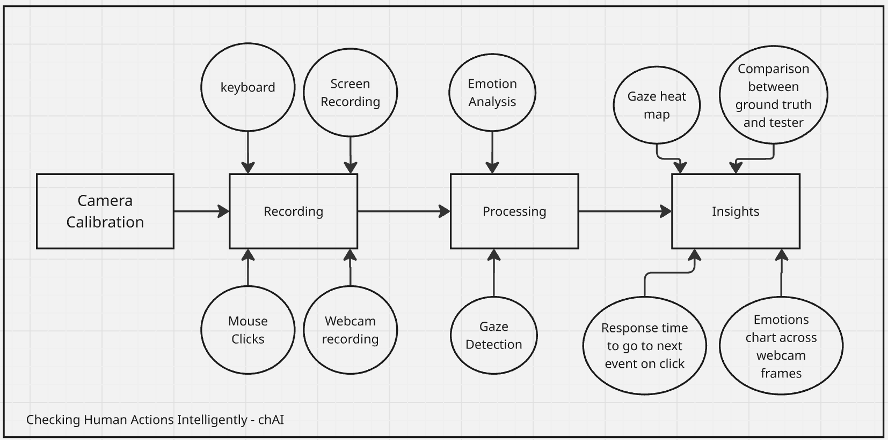
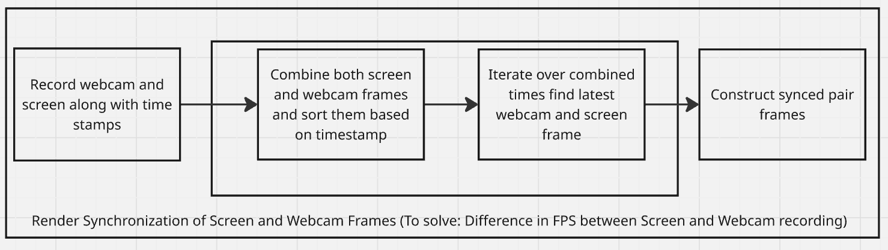
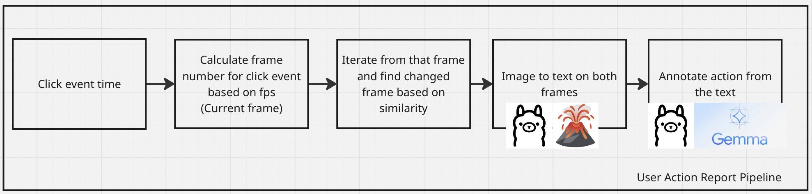
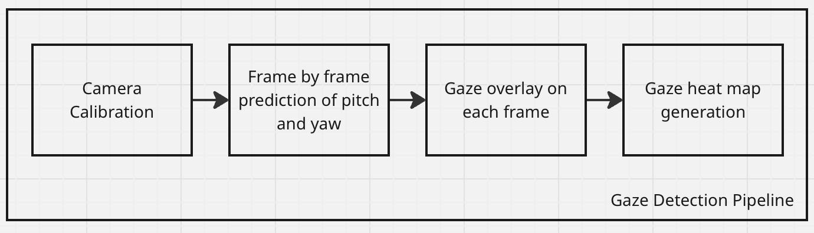
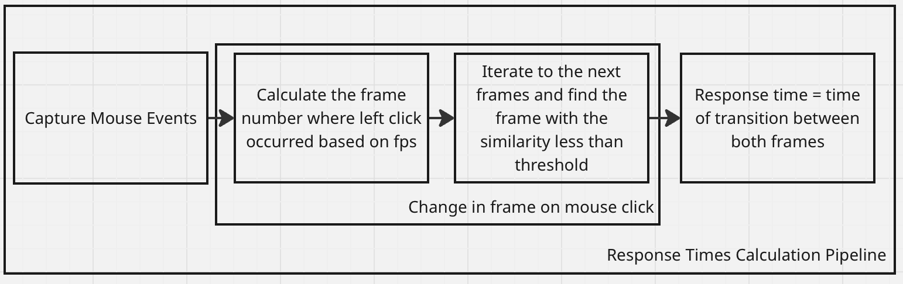
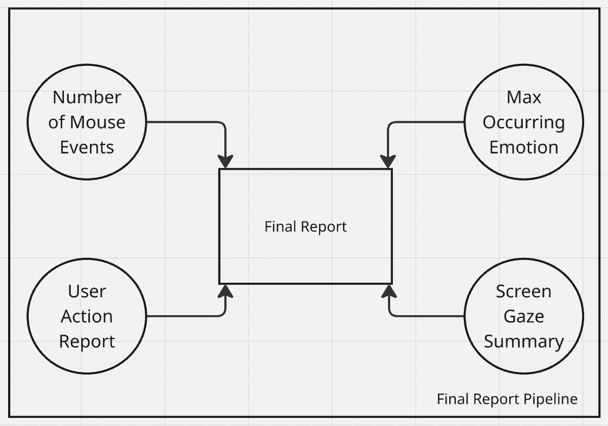

# chAI — Checking Human Actions Intelligently
 
**chAI** is a clever system that records user interactions in real time to determine whether a user interface is friction-free or not. It improves design feedback by using haptic and behavioral signals in addition to conventional metrics.

---

##  Motivation
 
We’ve all experienced frustrating websites or apps:
 
- Confusing design  
- Hard-to-find buttons  
- Unintuitive navigation  
 
It’s often hard to pinpoint why a UI feels off.
 
Designers typically rely on:
- Guesswork  
- User surveys
 
→ This doesn't capture real-time user reactions or the intutitveness of UI.

→ This process isn't streamlined and prone to errors.
 
    Hence, chAI
---
 
## 📌 High-Level Architecture



---

## ⏱️ Render Synchronization

To ensure accurate screen and webcam recordings are **time-synchronized**:



---

## 🖱️ User Actions Tracking

Annotating user actions based on mouse events for **task-based analysis**:



---

## 👀 Gaze Detection Pipeline

We perform **gaze detection** from webcam frames to understand where the user is focusing:



---

## ⏳ Response Time Measurement

chAI calculates **response times for specific UI tasks** to assess efficiency:



---

## 📊 Final Report

All insights are aggregated into a clear, actionable report for designers and developers:



---

## What chAI Tracks
 
We go beyond basic interaction tracking (clicks & scrolls).  
We track:
 
- Gaze direction  
- Facial expressions (emotion detection)  
- Keyboard/mouse behavior  
- Response times  
 
Combined with machine learning, this lets us:
- Detect if a UI is smooth or causing friction  
- Provide actionable feedback to improve the design
 
---
 
 
##  Features
 
- Keyboard Inputs  
- Mouse Inputs  
- Emotion Detection  
- Gaze Detection  
- Response Time Logging  
 
---
 
## File Structure
 
```
chAI/
├── README.md                   # Project overview
├── requirements.txt            # Python dependencies
├── main.py                     # Launches the core tracker
├── src/
│   ├── input_logger.py         # Mouse + keyboard tracking
│   ├── emotion_detector.py     # Webcam-based emotion analysis
│   ├── gaze_tracker.py         # Gaze estimation module
│   ├── response_timer.py       # Timing metrics per task
│   └── utils.py                # Shared functions/utilities
├── models/
│   └── emotion_model.pth       # Pretrained emotion recognition model
├── demo/
│   └── demo_video.mp4          # Sample user interaction video
├── data/
│   └── session_logs/           # Logged CSV/JSON results
└── docs/
   └── architecture.png        # System architecture diagram
```
 
---
 
## How to Use

### Prerequisites

- Download and Install the setup of Ollama from [this link](https://ollama.com/download/windows).
- Open terminal and run the following commands
```ollama pull gemma3:1b``` and ```ollama pull llava:13b```


### 1. Setup

```bash
git clone https://github.com/samyamaryal/chAI
cd chAI/CHAI
```

- Create a conda environment

```bash
conda create -n myenv python==3.10
conda activate myenv
pip install -r requirements.txt
```

**NOTE:** If you are running this on the Snapdragon X Elite or another ARM-64 architecture, you will need to perform the following steps (this is due to a package dependency on jax/ jaxlib, which do not currently support ARM64 out of the box):
```bash
pip uninstall jax jaxlib
```

Requirements:
- Python 3.10
- Conda
- Webcam access
 
---
 
### 2. Run chAI
 
```bash
streamlit run app.py
```
 
How to use:
- Launch the application
- Calibrate your camera by looking at the dot and pressing [space]
- Record while doing an action on UI (Ground Truth/Developer)
- Process Recoding
- Recod again while doing an action on UI (Tester)
- Process Recoding
- Compare againt  Tester's recoding and Developers Recoding
- Read the insights and improve UI/UX accordingly 
 

---
 
##  Meet the Team
 
- Badri
- Sanyog  
- Vivek  
- Samyam  
- Suvid
 
---
 
##  Future Work
 
- VR/AR device development support  
- Live friction score dashboard.
- Insights based on mouse movements.
- Recommentations to improve UI based on user interactions
- Integration with web and app builders - offer as a plugin for tools like figma, webflow or VS code to give live usability feedback duing development
- Personalized UI adaptation - dynamizally adjust UI layouts in real time based on individual user behaviour.
 
---
 
## License
 
MIT License — use freely, contribute openly.
 
> *chAI: Understand the human behind the click.*
